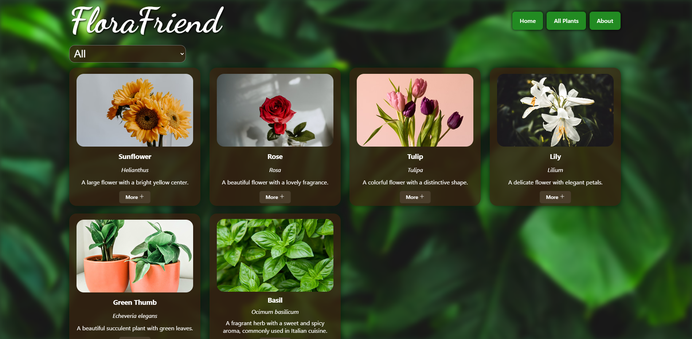
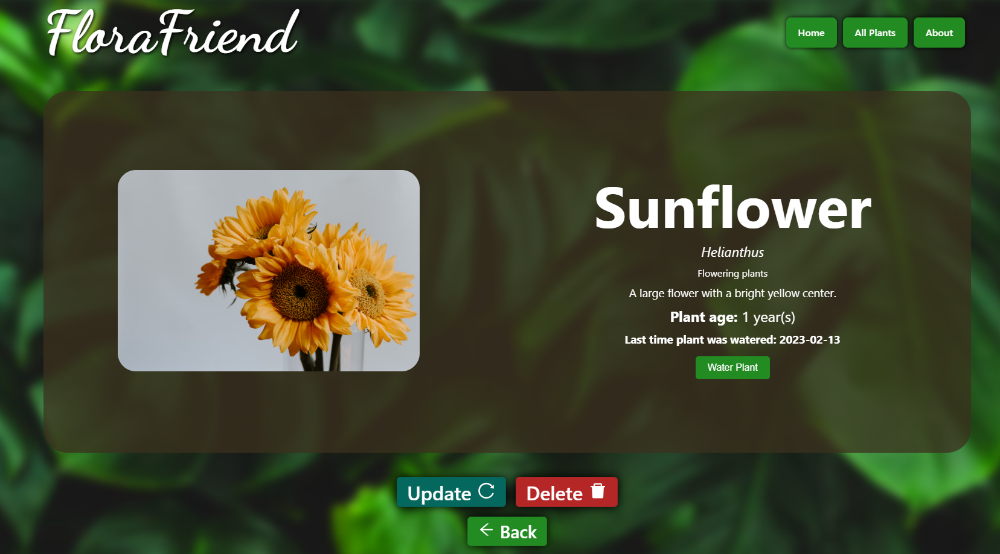
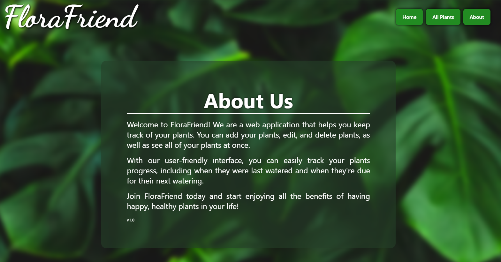

# FloraFriend App

### About the project

FloraFriend is a web application that helps you keep track of your plants. You can add your plants, edit, and delete plants, as well as see all of your plants at once.

## Features
- Add a new plant
- See details about the plant you added
- Edit an existing plant
- Delete a plant
- View all plants at once
- Animations on page change
- Filter plants by category

## Built with 🛠️
- React
- Framer Motion
- Node.js
- Express
- SQLite

### Run it locally

1. Clone the repo
   ```sh
   https://github.com/JoseAntonio5/FloraFriendApp.git
   ```
2. cd into `FloraFriend\backend`

3. Use `npm install` to install the dependencies

4. Run `node index.js` from the backend folder

5. (Optional) Run the file seedDB.js to seed the database with some data.
    You can do this by running <br>
    `node seedDB.js`

6. In another terminal cd into `FloraFriend\frontend`

7. Use `npm install` to install the dependencies

8. Run `npm start` to run the server.

The server will be running on `http://localhost:3000/`

### Screenshots

> FloraFriend homepage

> See all of your plants

> See more details about your plants

> About page


#### Author
José Antônio ©️ 2023